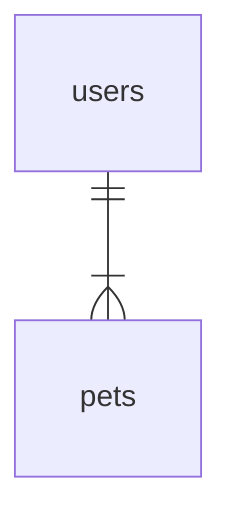
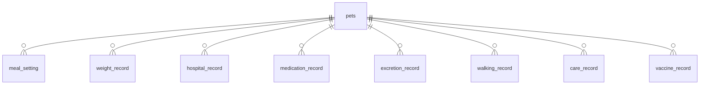
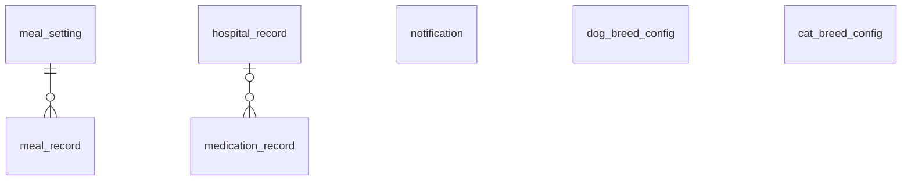

# データベース設計

## テーブル一覧

| テーブル論理名             | テーブル物理名   | 用途                                   |
| :------------------------- | :--------------- | :------------------------------------- |
| [users](./tables/users.md) | ユーザー情報     | 利用者情報                             |
| [pets](./tables/pets.md)   | ペット情報       | 利用者のペットの情報を記録する         |
| meal_setting               | 食事設定         | ペットの食事設定                       |
| meal_record                | 食事記録         | ペットの食事を記録する                 |
| weight_record              | 体重記録         | ペットの体重を記録する                 |
| hospital_record            | 通院記録         | ペットの通院を記録する                 |
| medication_record          | サプリメント記録 | ペットのサプリメント、投薬の記録をする |
| excretion_record           | 排せつ記録       | ペットの排せつを記録する               |
| walking_record             | 散歩記録         | ペットの散歩を記録する                 |
| care_record                | お手入れ記録     | ペットのお手入れを記録する             |
| vaccine_record             | ワクチン記録     | ペットのワクチン摂取の記録をする       |
| notification               | 通知             | ユーザーの通知設定                     |
| breed_info                 | 種情報           | 犬種、猫種情報を保持する               |

## ER図

### users

### pets

### others

### ER図関係文法

[info](https://mermaid.js.org/syntax/entityRelationshipDiagram.html#relationship-syntax)

| Value (left) | Value (right) |           Meaning            |
| :----------: | :-----------: | :--------------------------: |
|   &#124;o    |    o&#124;    |         Zero or one          |
| &#124;&#124; | &#124;&#124;  |         Exactly one          |
|      }o      |      o{       |       (no upper limit)       |
|   }&#124;    |    &#124;{    | One or more (no upper limit) |